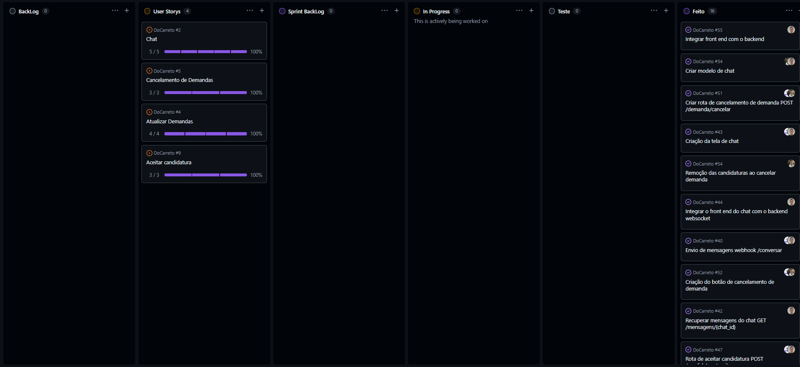
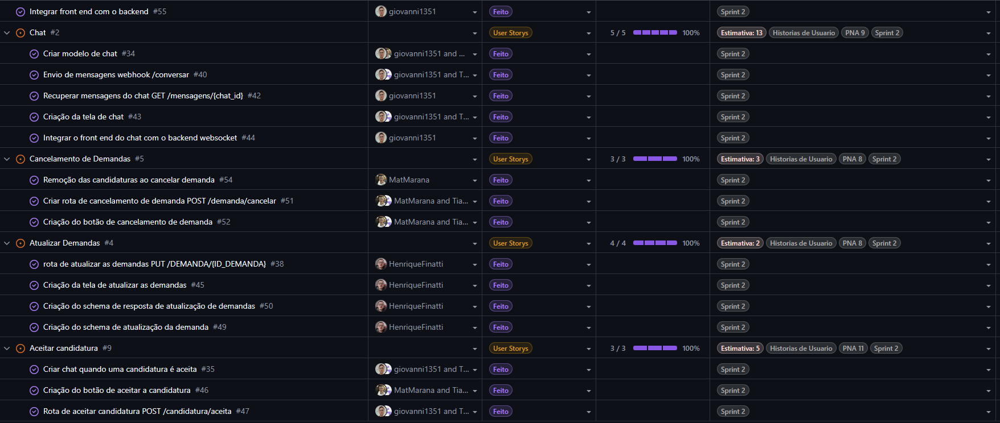
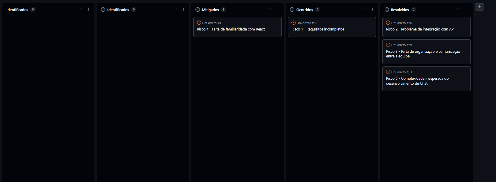
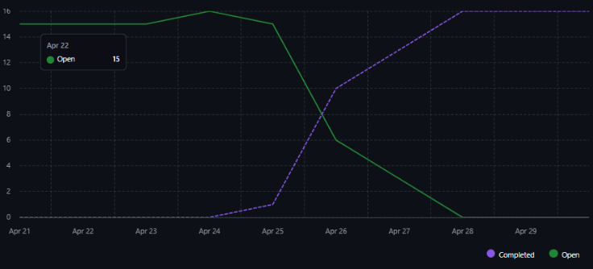

# Relatório Final - Projeto DoCarreto

## Participantes

- Giovanni Chahin Morassi RA: 22123025-3
- Tiago Fagundes RA: 22123017-0
- Henrique Finatti RA: 22123030-3
- Mateus Marana RA: 22123026-1

## 1. Histórias de Usuário Concluídas

Durante a sprint, a equipe trabalhou com autonomia total, sem dependências externas, e alcançou 100% de conclusão em todas as histórias propostas.
Foram entregues 16 tarefas relacionadas a 4 User Stories principais:

- **DoCarreto #2 - Chat:** A história de maior complexidade, envolvendo a criação do modelo de chat, tela, e integração full-stack com websocket e envio de mensagens via webhook.
- **DoCarreto #4 - Atualizar Demandas:** Envolveu a criação de rotas (PUT), telas de atualização e schemas de resposta/requisição.
- **DoCarreto #5 - Cancelamento de Demandas:** Implementação de rotas de cancelamento, botões na interface e lógica para remoção de candidaturas atreladas à demanda cancelada.
- **DoCarreto #9 - Aceitar Candidatura:** Criação da rota de aceite, botão na interface e gatilho para criação automática de chat após o aceite.

## 2. Validação das Entregas (Critérios de Aceite)

As entregas foram validadas conforme os seguintes critérios:

- **Aceitar Candidatura:** \* O status da demanda muda de "Aberta" para "Em andamento" quando o criador seleciona um candidato.
  - O chat aparece para o entregador e o criador assim que o vínculo ocorre.
  - Demandas "Em andamento" são ocultadas da lista pública.
- **Chat:**
  - Criação do chat entre as partes e persistência de mensagens.
  - Compartilhamento ágil de mensagens e notificação no app ao receber uma mensagem.
- **Cancelamento de Demandas:**
  - O criador pode cancelar demandas "Abertas" (sem entregador vinculado) pelo botão de detalhes.
  - Exige tela de confirmação antes da exclusão.
  - A opção é bloqueada para demandas "Aceitas" ou "Em andamento".
- **Atualizar Demandas:**
  - A edição de qualquer campo pelo criador reflete a atualização imediata.
  - Todos os campos da tela permitem atualização.

## 3. Kanban da Sprint e Kanban de Riscos

O **Kanban de Riscos** apresentou a seguinte situação final:

- **Identificados:** 0
- **Mitigados:** 1 (Risco 4 - Falta de familiaridade com React) 147
- **Ocorridos:** 1
- **Resolvidos:** 3 (Risco 1 - Requisitos incompletos; Risco 2 - Problema de integração com API; Risco 3 - Falta de organização e comunicação entre a equipe; Risco 5 - Complexidade inesperada do desenvolvimento do Chat)

## 4. Indicadores Finais da Sprint

- **Burndown:** A dinâmica de entrega mostrou pouco progresso no início devido ao começo atrasado das tarefas. O ritmo acelerou drasticamente na segunda semana com a implementação de dailies, permitindo cumprir as estimativas dentro do prazo.
- **Velocidade:** 23 Story Points.
- **Throughput:** 16 itens concluídos, gerando uma média de ~1,07 entregas por dia ao longo de 15 dias.
- **Cycle Time:** Média de 0 a 2 dias por tarefa por participante (com variação de velocidade conforme a complexidade).
- **WIP (Work In Progress):** 4 tarefas simultâneas, com cada membro responsável por sua respectiva tarefa.
- **Lead Time:** \* Chat: 10 dias.
  - Aceitar candidatura: 9 dias.
  - Atualizar Demandas: 8 dias.
  - Cancelamento de Demandas: 8 dias.

## 5. Retrospectiva Final

### Principais Acertos (O que melhorou)

- **Abordagem "Full-Story":** A equipe eliminou a separação tradicional entre Front-end e Back-end. Cada desenvolvedor assumiu a história de ponta a ponta, gerando fluidez e evitando atritos de integração.
- **Stack Tecnológica:** A escolha de Python/FastAPI no backend e React Native no aplicativo mostrou-se robusta e altamente eficiente.
- **Comunicação Diária:** A introdução de reuniões diárias (dailies) na segunda semana trouxe organização de tempo e decisões mais ágeis.

### Dificuldades Enfrentadas (O que piorou)

- **Início Tardio:** A equipe demorou a começar a programar, o que quase gerou picos de estresse na semana de entrega.
- **Mapeamento de Tasks:** Pequenos detalhes foram desenvolvidos sem registro no board, exigindo mais atenção na gestão das tarefas.
- **Complexidade do Chat:** As rotas, a interface e os websockets do Chat foram mais difíceis do que o esperado, evidenciando a necessidade de análises técnicas prévias mais profundas.

### Melhorias Aplicadas (Plano de Ação)

- **Iniciar Cedo:** Começar as atividades de código logo nos primeiros dois dias da sprint para garantir uma distribuição uniforme do esforço.
- **Granularidade:** Detalhar mais as tarefas e registrar pequenos ajustes no JIRA/Trello durante o planejamento.
- **Dailies Consistentes:** Manter reuniões diárias desde o primeiro dia de trabalho para garantir o foco contínuo.
- **Priorização:** Focar no início as tarefas que podem gerar dependências futuras para o resto da equipe.

### Lições Aprendidas

- **O Poder de Fazer Juntos:** O maior acerto foi não criar silos de conhecimento (Front vs Back).
- Permitir que o mesmo desenvolvedor atue da modelagem (Python) até a tela (React) trouxe senso de propriedade, diminuiu a espera por códigos de terceiros e nivelou tecnicamente toda a equipe.

## 6. Histórias Pendentes

- **Nenhuma pendência registrada:** O time conseguiu um índice de 100% nas estimativas propostas para esta fase, com 16 tarefas concluídas e 0 bloqueios externos relatados no período.
