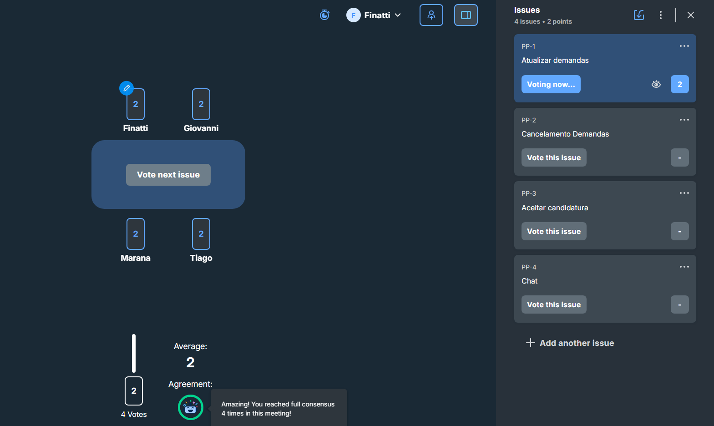
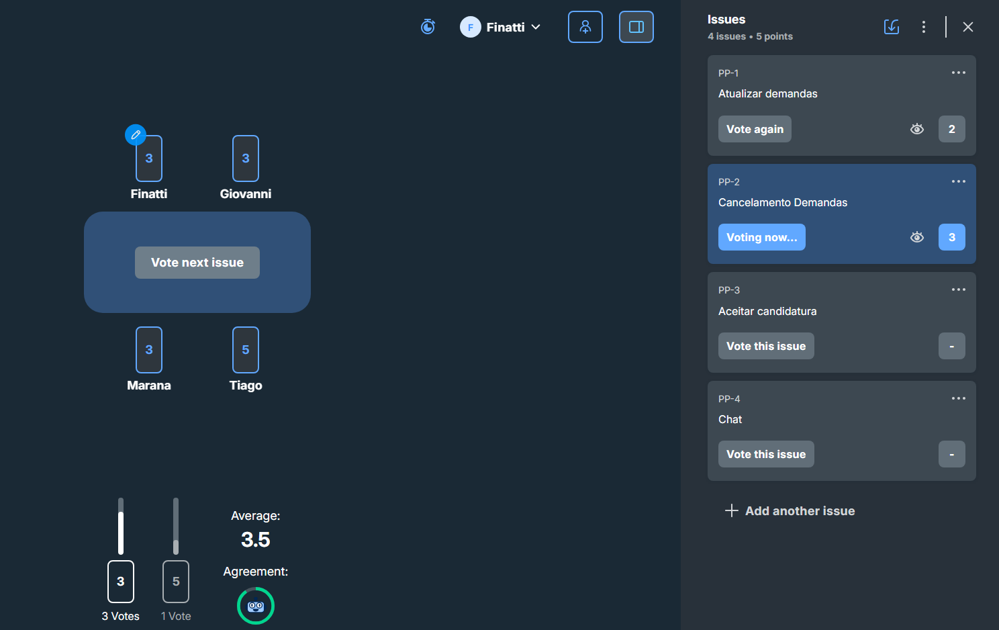
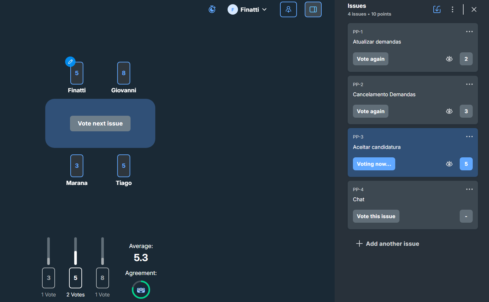
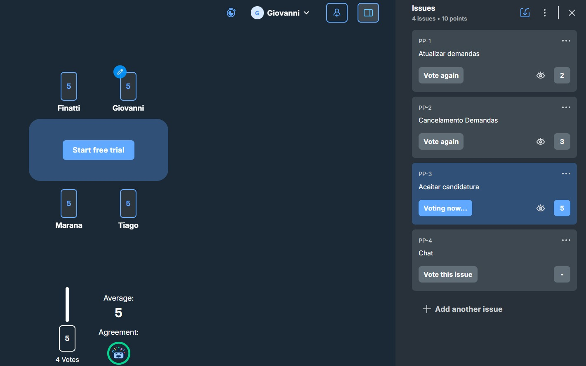
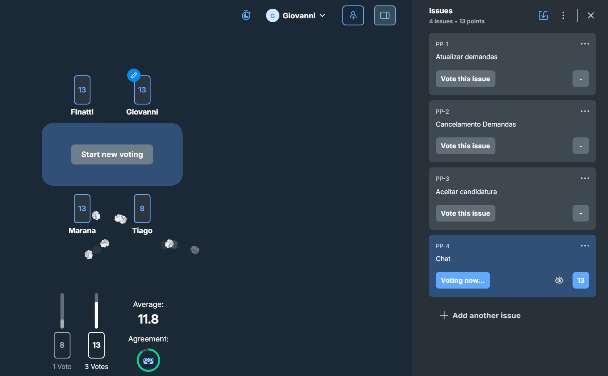

# Relatório Planning Poker 11/04/2026

## Histórias de usuario discutidas

- ### Atualizar demandas
  - Como um criador de demandas quero poder editar as demandas para corrigir alguma informação incorreta

- ### Cancelamento de demandas
  - Como um usuario criador de demandas quero poder deletar uma demanda que cadastrei, pois posso desistir de tal objetivo

- ### Aceitar Candidatura
  - Como um criador de demandas quero aceitar entregadores para as demandas para que o entregado escolhido possa começar o serviço
  - Como um entregador quero ser aceito em demandas para que eu à realize

- ### Chat
  - Como entregador quero poder conversar com o criador da demanda para entender como realizar a entrega
  - Como um criador de demanda quero conversar com o entregador para detalhar e falar como deve ser feito a entreg

## Evidencias

- ### Atualizar demandas

  Ponto totalizados para essa história: 2
  

- ### Cancelamento de demandas

  Pontos totalizados para essa história: 3
  

- ### Aceitar Candidatura

  Pontos totalizados para essa história: 5
  - Primeira jogada
    
  - Segunda Jogada
    

- ### Chat
  Pontos totalizados para essa história: 13
  

## Total

O total de pontos que foram avaliados para essa sprint foi de 23

- ### Justificativa
  - Atualizar demandas:
    O sistema terá apenas que validar os dados, e atualizar no banco de dados, e tambem a criação de uma tela especifica para isso
  - Cancelamento de demandas:
    O sistema deve remover todas as candidaturas, criação do botão para o cancelamento que deve aparecer apenas para o criador de demandas, o sistema tambem deve garantir que não seja mais mostrada para os caminhoneiros
  - Aceitar candidatura:
    O sistema deve conseguir criar uma nova sessão de chat, atualizar o status da demanda, criar o botão para aceitar a candidatura, remoção das candidaturas que não foram verificadas, garantir que essa demanda não seja demonstrada para os outros caminhoneiros
  - Chat:
    O sistema deve conseguir distribuir mensagens dos clientes, então será necessário a criação de um sistema de pub/sub, onde entendemos necessário um broker, alem de validação de regras de segurança e tambem armazenamento de mensagens para acesso futuro do chat.

### Reflexão

O time conseguiu entender muito bem as dificuldades, percebemos que as diferenças de avaliações de dificuldade as vezes estavam por conta da clareza do que deveria ser feito, mas conversando e entendendo tudo que devemos realizar foi facil chegarmos no consenso.
