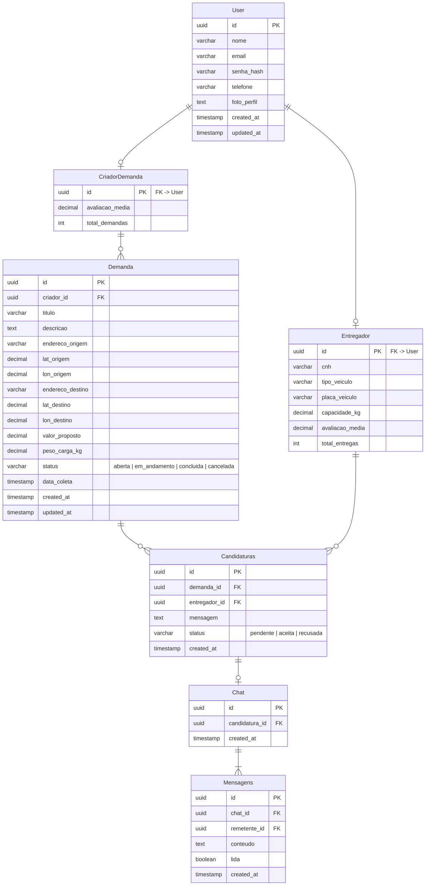

```mermaid
erDiagram

    User ||--o| CriadorDemanda : ""
    User ||--o| Entregador : ""
    CriadorDemanda ||--o{ Demanda : ""
    Demanda ||--o{ Candidaturas : ""
    Entregador ||--o{ Candidaturas : ""
    Candidaturas ||--o| Chat : ""
    Chat ||--|{ Mensagens : ""

    User {
        uuid        id          PK
        varchar     nome
        varchar     email
        varchar     senha_hash
        varchar     telefone
        text        foto_perfil
        timestamp   created_at
        timestamp   updated_at
    }

    CriadorDemanda {
        uuid        id          PK  "FK -> User"
        decimal     avaliacao_media
        int         total_demandas
    }

    Entregador {
        uuid        id              PK  "FK -> User"
        varchar     cnh
        varchar     tipo_veiculo
        varchar     placa_veiculo
        decimal     capacidade_kg
        decimal     avaliacao_media
        int         total_entregas
    }

    Demanda {
        uuid        id              PK
        uuid        criador_id      FK
        varchar     titulo
        text        descricao
        varchar     endereco_origem
        decimal     lat_origem
        decimal     lon_origem
        varchar     endereco_destino
        decimal     lat_destino
        decimal     lon_destino
        decimal     valor_proposto
        decimal     peso_carga_kg
        varchar     status          "aberta | em_andamento | concluida | cancelada"
        timestamp   data_coleta
        timestamp   created_at
        timestamp   updated_at
    }

    Candidaturas {
        uuid        id              PK
        uuid        demanda_id      FK
        uuid        entregador_id   FK
        text        mensagem
        varchar     status          "pendente | aceita | recusada"
        timestamp   created_at
    }

    Chat {
        uuid        id              PK
        uuid        candidatura_id  FK
        timestamp   created_at
    }

    Mensagens {
        uuid        id          PK
        uuid        chat_id     FK
        uuid        remetente_id FK
        text        conteudo
        boolean     lida
        timestamp   created_at
    }
```
